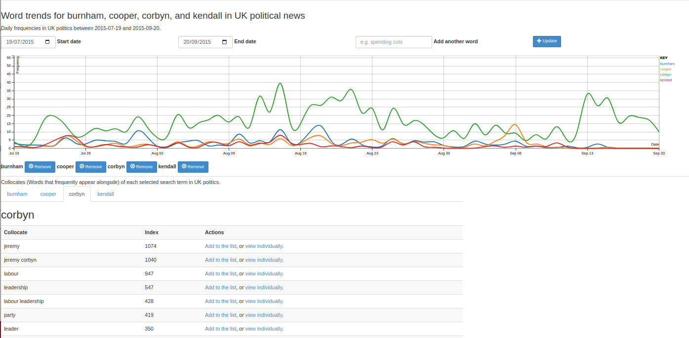

# A Word Trend Analysis Tool For News Content

This software gathers a corpus of news content from RSS feeds over time, and processes them such that a web client can be used to analyse trends.

An example can be seen in the graph below, showing the fortunes of the candidates in the [2015 British Labour leadership race](https://en.wikipedia.org/wiki/2015_Labour_Party_leadership_election_(UK)).

This project was started in about 2007 and went through a series of iterations. What you see here is the result of a 2025 tidy-up of some old code, removing a load of unnecessary stuff originally developed for the website it was part of.

## Components

The three parts of this project are split into directories at the top level.

### processing

The [processing](./processing/) directory contains the PHP scripts which harvest RSS feeds and process them into the corpus.

### client

The [client](./client/) directory contains a web client for analysing the data.

### data

The data directory contains the processed corpus data. This project does not ship with a corpus, you will have to collect your own.

## Getting started

### Requirements

This software requires PHP to be installed.

### Creating a corpus

You will need to configure and run the ./processing/processing.sh script to create your corpus. Here follows a quick run-down of the requirements and startup.

#### Configuring and running processing.php

There are a set of variable definitions for paths at the top of ./processing/processing.php. With the default directory structure they should work without modification, however it is suggested you cast your eye over them.

You will need to create your own feed list in ./processing/feedlist/feedlist.txt. The distributed version contains a couple of example feeds as well as instructions.

With everything configured, you should be able to open a terminal in ./processing, and run processing.sh

Once you are happy with the operation, you can add this script to a cron job to run every few hours and build your corpus over time. Alternatively for testing you can use the every command to schedule it every few hours.

### Using the client

The client requires a web server to run. You can of course set one up, but for testing purposes the simplest way to do this is to use PHP's built-in web server. The ./start-web-server.sh script does that, allowing you to go to localhost:8080/client in your browser to run the client.

The client will require some configuration. Towards the top of ./client/index.php is a group of configuration variables. Most of them will not need changing with the default directory structure.

You will need to change $startweekdate to reflect the start of yopur corpus, this is the week the client will display at start.

$noisewords is an array of noise words that reflects my use of the system for British politics. You may need to make a few edits.

## Licence

The code in this repository ls copyright (c) Jenny List, 2007-2025, and licensed under the MIT licence, EXCEPT for the following components which are here under their own licences:

[SimplePie](https://github.com/simplepie/simplepie) is a PHP RSS reader library.
It is copyright (c) 2004-2023, Ryan Parman and Sam Sneddon, and it is licenced under the BSD 3-clause licence.

[Bootstrap](https://getbootstrap.com/) is a web front end library.
It is copyright (c) 2011-2025 The Bootstrap Authors, and it is licenced under the MIT licence.

[D3](https://d3js.org/) is a data visualisation library.
It is copyright (c) 2010-2023 Mike Bostock, and it is licenced under the ISC licence.
